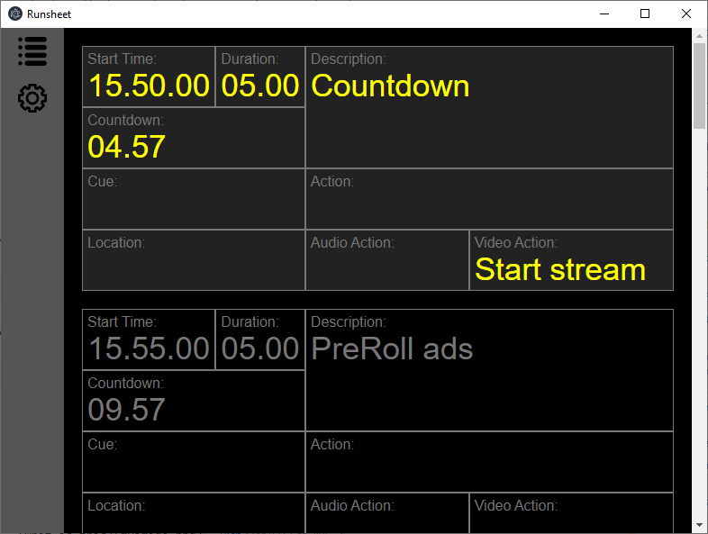

# Runsheet
Runsheet is used to display the program of an event. It imports from a google sheets document directly input the program.

It integrates with OBS (Open Broadcast Software) to be able to toggle a overlay source for that specific part of the event. 

It includes socket connection intended to integrate with Bitfocus Companion. So you are able to switch to the next part of your event, and the trigger the overlay to be visible. 



## Installing
``` bash
npm install
```

## Running
``` bash
npm start
```

## Building
``` bash
npm run build
npm run setup
```

## OBS integration

To use the OBS integration you need the OBS websocket plugin installed. In the settings panel in the app you can put in the ip and port given in OBS. 

## Companion integration

To use the companion integration you need to use the tcp socket plugin in companion. 

There are 2 commands available.

To switch the the next part
```
nextSlide
```
To toggle the current overlay
```
overlay
```